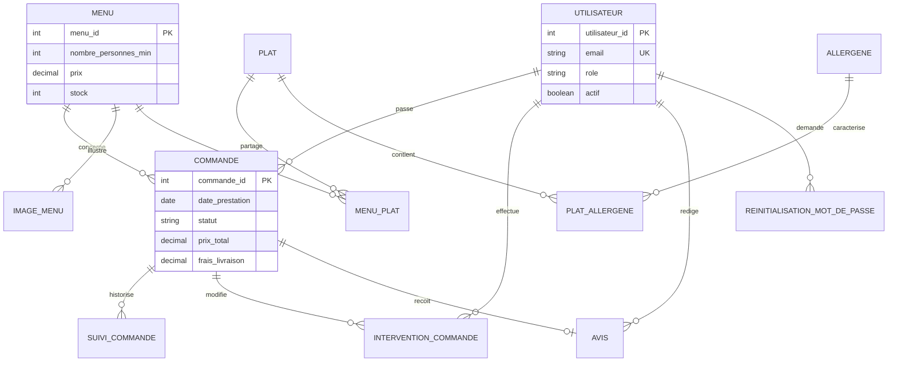
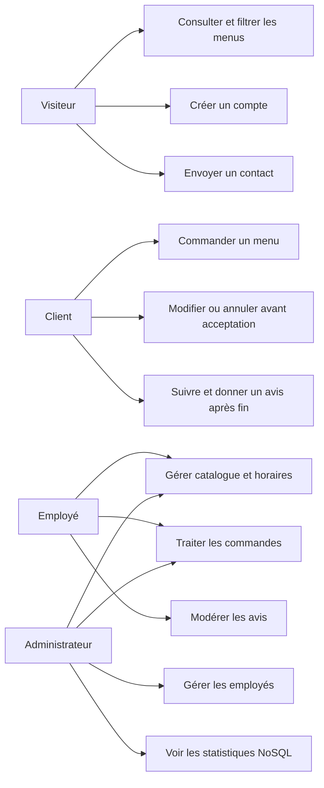
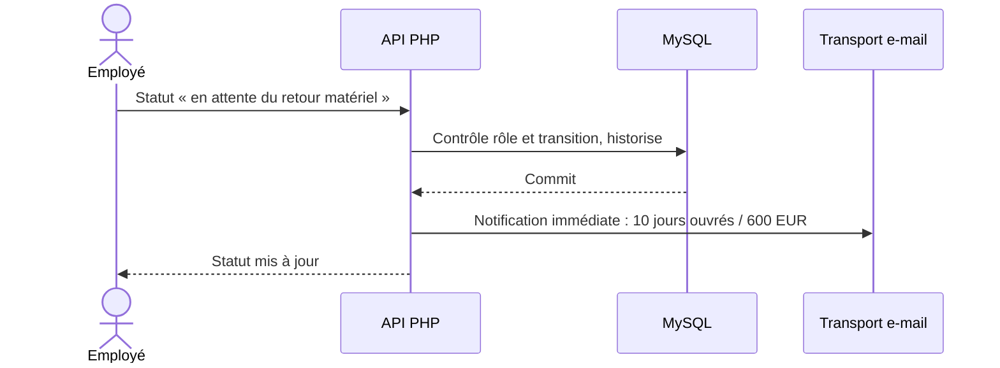

# Documentation technique - Vite & Gourmand

## 1. Réflexion initiale et choix technologiques

Le besoin combine un catalogue public dynamique, des commandes et comptes avec contraintes d'intégrité, et un graphique de statistiques fondé sur une base non relationnelle. HTML/CSS/JavaScript natifs évitent une chaîne de compilation pour ce projet de taille modérée. PHP et PDO permettent des endpoints simples, des requêtes préparées et des transactions MySQL. MySQL représente les relations fortes entre utilisateurs, commandes, menus, plats, allergènes et avis. CouchDB est retenu pour une projection documentaire des commandes destinée aux statistiques : son API HTTP se pilote depuis PHP avec cURL, sans pilote de base supplémentaire. Cette solution répond au besoin d'une base non relationnelle distincte de MySQL.

Les limites connues sont la disponibilité du service de distance externe, la configuration réelle du transport e-mail et l'absence d'instance CouchDB testée. La synchronisation est codée pour la destination locale expressément approuvée, mais sa reprise historique n'a été exécutée qu'en mode sans écriture (`--dry-run`). Le graphique refuse de présenter des chiffres MySQL sous une étiquette NoSQL lorsque CouchDB est absent.

## 2. Environnement de travail

- PHP 8.1 ou plus avec `pdo_mysql` et `curl` ; MySQL 8 ou MariaDB compatible ; CouchDB 3 pour les statistiques.
- Site statique dans `frontend/` et API JSON dans `backend/api/` ; serveur local : `php -S 127.0.0.1:8000` depuis la racine.
- Configuration via variables d'environnement : `DB_HOST`, `DB_PORT`, `DB_NAME`, `DB_USER`, `DB_PASSWORD`, `APP_BASE_URL`, `CONTACT_EMAIL`, `MAIL_TRANSPORT`, `COUCHDB_URL`, `COUCHDB_DATABASE`, `COUCHDB_USER`, `COUCHDB_PASSWORD`.
- Les tests SQL refusent toute base différente de `vite_gourmand_test` et vérifient `SELECT DATABASE()` sur la connexion de l'application avant d'écrire.
- `.env.example` est documentaire : aucun chargeur `.env` implicite.

## 3. Modèle conceptuel de données



Le schéma documentaire prévu est `commande:<id>` avec identifiant de commande, identifiant et titre du menu, date de prestation, statut et total. Le code de projection ne sélectionne aucun nom, e-mail, téléphone ni adresse du client. Aucune base documentaire réelle n'a encore été validée.

## 4. Cas d'utilisation



## 5. Séquences essentielles

```mermaid
sequenceDiagram
    actor Client
    participant UI as Formulaire
    participant API as API PHP
    participant SQL as MySQL
    participant NS as CouchDB
    participant Mail as Transport e-mail
    Client->>UI: Choisit menu, date, lieu et convives
    UI->>API: POST /creer_commande.php + CSRF
    API->>SQL: Vérifie compte, stock et menu ; crée la commande
    SQL-->>API: Commit et identifiant
    API->>NS: Projette les champs statistiques si la destination locale de test est configurée
    API->>Mail: Confirme la commande
    API-->>UI: Total, frais et statut
```



L'énoncé prévoit cette notification immédiate ; il ne demande pas de tâche automatique dix jours plus tard. La projection CouchDB est codée mais n'a pas été vérifiée sur une instance réelle, indisponible localement au moment de cet audit.

## 6. Sécurité et règles de gestion

- Hachage des mots de passe et jetons de réinitialisation à usage unique ; session serveur, contrôle de rôle et contrôle du compte actif.
- Requêtes préparées, transactions pour commandes et stock, jeton CSRF pour chaque écriture authentifiée.
- Les avis non validés ne sont pas publics. La modification/annulation par le personnel exige un mode de contact et un motif enregistrés.
- Prix, remise, distance et livraison sont calculés sur le serveur. Les données du graphique sont séparées des données personnelles du client.
- Les textes des conditions propres aux menus restent libres ; les délais n'ont pas de champ structuré.

## 7. Déploiement et exploitation

La procédure détaillée figure dans [deploiement-studi.md](deploiement-studi.md). Il faut préparer un hébergement PHP avec HTTPS, MySQL et CouchDB, créer des comptes techniques à privilèges minimaux, appliquer les scripts SQL sur la base choisie, renseigner les variables, fournir un transport e-mail et configurer les services de géocodage/routage. Après migration, rejouer la recette sur une base de préproduction isolée. La publication nécessite le choix d'hébergement, les identifiants et le domaine du propriétaire du projet.
